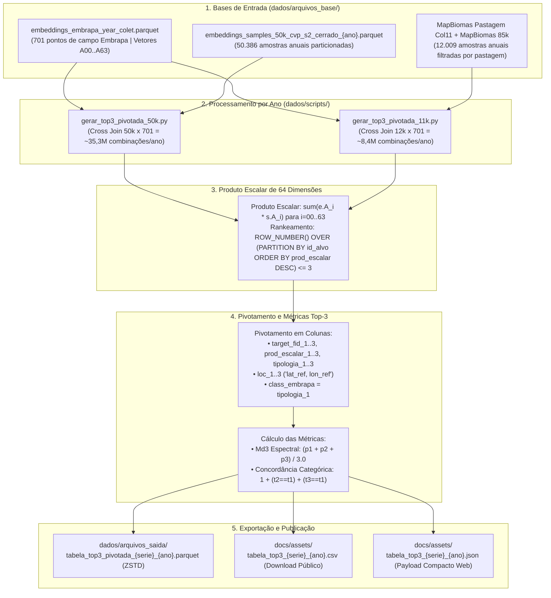

# Fluxograma do Pipeline de Processamento (Top-3 Pivotado & Md3)

Este documento descreve o fluxo completo de dados e processamento SQL (DuckDB) utilizado para calcular a similaridade espectral por produto escalar de 64 dimensões e gerar as tabelas Top-3 pivotadas das séries **50k** e **12k** (2019–2025).

---

## Diagrama Geral do Pipeline (Mermaid)

---

## Detalhamento das Etapas

1. **Particionamento Temporal**:
   - Os embeddings anuais de 2019 a 2025 são mantidos em arquivos particionados leves (~25 MB cada), permitindo processamento em paralelo com baixo consumo de memória RAM.

2. **Cálculo do Produto Escalar de 64 Dimensões**:
   - Como os vetores de embeddings do modelo de fundação possuem norma unitária, o produto escalar euclidiano $\sum_{i=0}^{63} (A_i^{\text{embrapa}} \times A_i^{\text{amostra}})$ é equivalente à similaridade de cosseno.

3. **Seleção dos Top-3 Matches e Pivotamento**:
   - Para cada pixel-alvo, selecionam-se as 3 amostras de campo mais similares. A tabela é pivotada de formato longo para formato largo com atributos detalhados de cada um dos 3 vizinhos mais próximos.

4. **Geração de Saídas Otimizadas**:
   - **Parquet (ZSTD)**: Armazenamento analítico de alta eficiência para cientistas de dados e QGIS.
   - **CSV**: Compatibilidade universal com planilhas e softwares legados.
   - **JSON Compacto**: Estrutura colunar matricial minimizada para renderização ultrarrápida no Leaflet e Chart.js na plataforma web.
