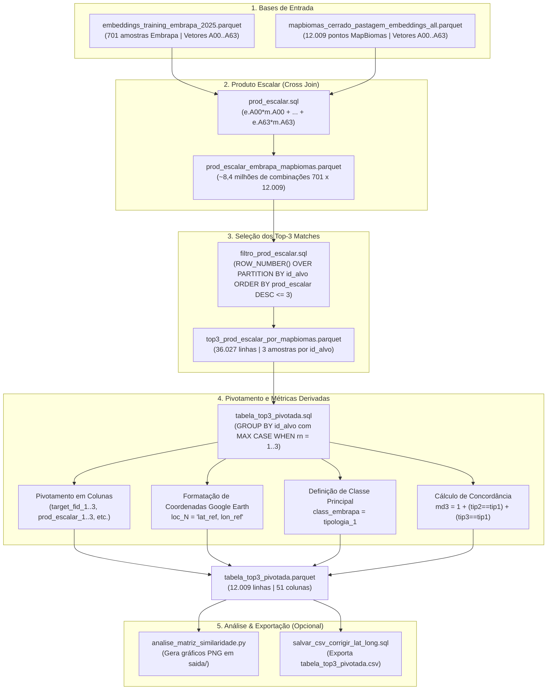

# Fluxograma do Pipeline de Processamento (Top-3 Pivotado)

Este documento descreve o fluxo completo de dados e processamento SQL (DuckDB) utilizado para gerar o arquivo final `tabela_top3_pivotada.parquet`.

---

## Diagrama do Pipeline (Mermaid)

---

## Descrição Detalhada das Etapas

### Etapa 1: Arquivos de Entrada
* **Embrapa** (`embeddings_training_embrapa_2025.parquet`): 701 pontos de campo contendo embeddings temporais de 64 dimensões (`A00` a `A63`) e atributos descritivos (`TARGET_FID`, `Tipologia_`, `altitude`, `lat_ref`, `lon_ref`, etc.).
* **MapBiomas** (`mapbiomas_cerrado_pastagem_embeddings_all.parquet`): 12.009 pontos de pastagem no Cerrado contendo os mesmos vetores de 64 dimensões e identificadores (`id_alvo`, `lat_alvo`, `lon_alvo`, `class_2025`).

### Etapa 2: Cálculo do Produto Escalar (`prod_escalar.sql`)
* Realiza um `CROSS JOIN` entre todas as amostras Embrapa e todos os pontos MapBiomas.
* Calcula o **produto escalar** (similaridade cosseno) somando as multiplicações termo a termo: $\sum_{i=0}^{63} (e.A_i \cdot m.A_i)$.
* **Resultado**: Matriz densa de ~8.418.309 linhas (`701 x 12.009`).

### Etapa 3: Filtragem Top-3 (`filtro_prod_escalar.sql`)
* Utiliza a função de janela `ROW_NUMBER() OVER (PARTITION BY id_alvo ORDER BY prod_escalar DESC)` para ranquear do maior para o menor produto escalar dentro de cada `id_alvo`.
* Aplica `QUALIFY rn <= 3` mantendo apenas as **3 amostras Embrapa mais similares** para cada ponto MapBiomas.
* **Resultado**: Tabela reduzida para 36.027 linhas.

### Etapa 4: Pivotamento e Atributos Derivados (`tabela_top3_pivotada.sql`)
Transforma a tabela de formato longo (3 linhas por ponto) em formato largo (**1 linha por ponto `id_alvo`**):
1. **Pivotamento**: Cria colunas numeradas `_1`, `_2`, `_3` para todos os atributos Embrapa (ex: `target_fid_1`, `prod_escalar_1`, ..., `target_fid_3`, `prod_escalar_3`).
2. **Coordenadas Google Earth (`loc_1`, `loc_2`, `loc_3`)**: Concatena `lat_ref` e `lon_ref` no formato `"lat, lon"`.
3. **Classe Atribuída (`class_embrapa`)**: Define a tipologia do top-1 como a classe representativa.
4. **Métrica de Concordância (`md3`)**: Avalia quantas das 3 amostras concordam com a classe do top-1:
   $$\text{md3} = 1 + \mathbb{1}[\text{tipologia\_2} = \text{tipologia\_1}] + \mathbb{1}[\text{tipologia\_3} = \text{tipologia\_1}]$$
* **Resultado Final**: `tabela_top3_pivotada.parquet` contendo 12.009 linhas e 51 colunas.
